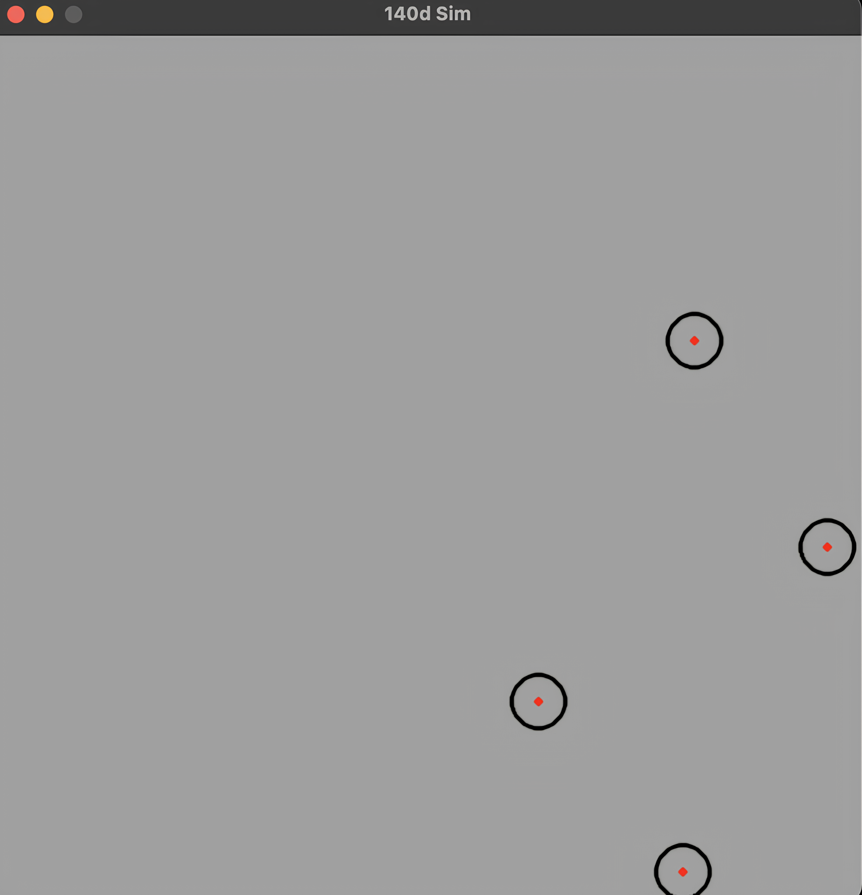

# 140d Sim

A physics-based simulation of bouncing balls with gravity and collision detection, built using Pygame.




## Table of Contents
- [Overview](#overview)
- [Features](#features)
- [Installation](#installation)
  - [Local Setup](#local-setup)
  - [Docker Setup](#docker-setup)
- [Usage](#usage)
- [Contributing](#contributing)

---

## Overview

This project simulates the motion of multiple balls in a 2D space, incorporating gravity, bouncing off walls, and collision detection between balls. It is built using Python and Pygame, making it a great example of basic physics simulations and game development.

---

## Features

- **Gravity Simulation**: Balls are affected by gravity, causing them to accelerate downward.
- **Wall Collision**: Balls bounce off the edges of the screen with realistic physics.
- **Ball Collision**: Balls collide with each other, conserving momentum and energy.
- **Customizable Parameters**: Easily adjust the number of balls, their initial positions, and gravity strength.
- **Cross-Platform Support**: Works on macOS, Windows, and Linux (with Docker support).

---

## Installation

### Local Setup

1. **Clone the repository**:
   ```bash
   git clone https://github.com/140d/sim.git
   cd sim
   ```

2. **Install dependencies**:
   - Ensure Python 3.12 is installed.
   - Install Pygame:
     ```bash
     pip install pygame
     ```

3. **Run the simulation**:
   ```bash
   python app/main.py
   ```

### Docker Setup

1. **Install Docker**:
   - Download and install Docker from [here](https://www.docker.com/products/docker-desktop).

2. **Build the Docker image**:
   ```bash
   docker build -t sim .
   ```

3. **Run the Docker container**:
   - For macOS:
     - Install [XQuartz](https://www.xquartz.org/) and ensure it is running.
     - Allow connections from network clients in XQuartz preferences.
     - Run the container:
       ```bash
       docker run -it --env="DISPLAY=host.docker.internal:0" sim
       ```
   - For Linux/Windows:
     - Adjust the `DISPLAY` environment variable as needed.
     - Run the container:
       ```bash
       docker run -it --env="DISPLAY=:0" sim
       ```

---

## Usage

- **Run the simulation**: Execute the program to see the balls bouncing and colliding.
- **Exit the simulation**: Press the `ESC` key or close the window to stop the simulation.
- **Modify the code**: Adjust the number of balls, their initial positions, or gravity strength in `app/main.py`.

---

## Contributing

Contributions are welcome! If you'd like to contribute, please follow these steps:

1. Fork the repository.
2. Create a new branch for your feature or bugfix.
3. Commit your changes.
4. Submit a pull request.

Please ensure your code follows the project's style and includes appropriate documentation.

---

## Acknowledgments

- Thanks to the Pygame community for providing an excellent framework for game development.
- Inspired by basic physics simulations and educational projects.

---

Feel free to customize this `README.md` further to suit your project's needs!
